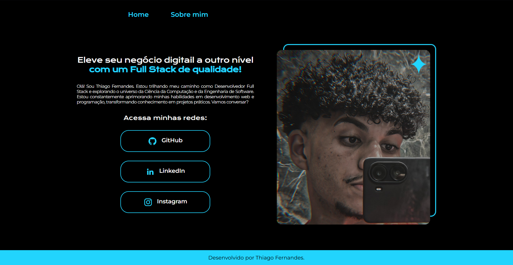

# 👨🏻‍💻 Developer | Portfólio  

Este projeto consiste em um portfólio web desenvolvido para centralizar minha apresentação profissional e reunir informações sobre minha trajetória como Desenvolvedor Full Stack, contando um pouco sobre minha história, formação e objetivos na área de tecnologia. A aplicação apresenta uma interface responsiva composta por uma página inicial com introdução, links para minhas redes profissionais e uma seção dedicada à minha trajetória e evolução na área de desenvolvimento de software. O projeto foi desenvolvido com HTML, CSS e JavaScript, aplicando conceitos de estruturação semântica, estilização responsiva, organização de componentes e boas práticas de desenvolvimento front-end. Além de servir como meu portfólio pessoal, a aplicação funciona como uma vitrine para demonstrar minha evolução técnica, meu repertório em desenvolvimento web e meu compromisso com o aprendizado contínuo por meio de cursos, projetos e desafios práticos.

   

### ⚙ Tecnologias Utilizadas

  
  
  

### ✔️ Funcionalidades 

- **Página inicial personalizada**: Apresenta uma introdução sobre o desenvolvedor, criando uma primeira impressão profissional aos visitantes.
- **Seção Sobre Mim**: Exibe informações pessoais, trajetória e objetivos dentro da área de desenvolvimento.
- **Interface moderna**: Possui um design organizado e visualmente agradável para facilitar a navegação.
- **Navegação entre seções**: Permite acessar facilmente as informações disponíveis no portfólio.
- **Design responsivo**: Interface adaptada para smartphones, tablets e computadores, garantindo uma boa experiência em qualquer tamanho de tela.

### 🌐 Como Acessar ?

1. Clone este repositório para sua máquina local.
2. Abra o arquivo `index.html` em seu navegador web.
3. Ou, [Clique aqui](https://developer-portfolio-alpha-mauve-99.vercel.app).
4. Explore meu portfólio e minha jornada como desenvolvedor!
